<!-- ============ BANNER ============ -->
<p align="center">
  
</p>

<!-- ============ TYPING ============ -->
<p align="center">
  
</p>

<!-- ============ BADGES ============ -->
<p align="center">
  <a href="https://github.com/Kina25"></a>
  
  <a href="https://www.linkedin.com/in/bruno-matos-mascarenhas-43223719a/"></a>
  <a href="mailto:brunnomitto@gmail.com"></a>
</p>

<br/>

<!-- ============ SOBRE ============ -->
## &nbsp;👨‍💻 Sobre mim

Desenvolvedor **backend** focado em **SaaS, automações e sistemas prontos para produção**. Construo do zero — de APIs escaláveis a plataformas multi-tenant completas — priorizando o que resolve problema de negócio, não só código.

```yaml
foco:        arquitetura backend & APIs com FastAPI
plataformas: SaaS multi-tenant
infra:       Docker · Nginx · Linux
automacao:   n8n · integracoes (Slack, Google Sheets, APIs corporativas)
```

<br/>

<!-- ============ STACK ============ -->
## &nbsp;🛠️ Tech Stack

<p align="center">
  
</p>

<br/>

<!-- ============ PROJETO ============ -->
## &nbsp;🚀 Projeto em destaque

<table align="center">
  <tr>
    <td width="600">
      <h3>🧾 BaianoFeet — Plataforma SaaS de Gestão de Lojas</h3>
      <p>Sistema completo de gestão comercial com arquitetura <b>multi-tenant</b>, desenvolvido do zero para produção. Isolamento de dados por empresa, PDV responsivo, controle de estoque, multiusuário por perfil, relatórios financeiros e integrações via API.</p>
      <p>
        
        
        
        
        
        
      </p>
      <!-- Quando o repositorio estiver publico, adicione:
      <a href="https://github.com/Kina25/NOME-DO-REPO">🔗 Ver projeto</a> -->
    </td>
  </tr>
</table>

<p align="center"><i>Também já entreguei: sistemas de PDV, ordens de serviço, bots para Discord, integrações com Slack e Google Sheets, APIs corporativas e automações com n8n.</i></p>

<br/>

<!-- ============ STATS ============ -->
## &nbsp;📈 GitHub Stats

<!-- Painel gerado pela Action Metrics (SVG hospedado no repo — nunca quebra) -->
<p align="center">
  
</p>

<p align="center">
  
</p>

<p align="center">
  
</p>

<!-- ============ SNAKE ============ -->
<p align="center">
  
</p>

<br/>

<!-- ============ CONTATO ============ -->
## &nbsp;🌐 Contato

<p align="center">
  <a href="mailto:brunnomitto@gmail.com"></a>
  <a href="https://www.linkedin.com/in/bruno-matos-mascarenhas-43223719a/"></a>
  <a href="https://github.com/Kina25"></a>
</p>

<p align="center">
  
</p>
